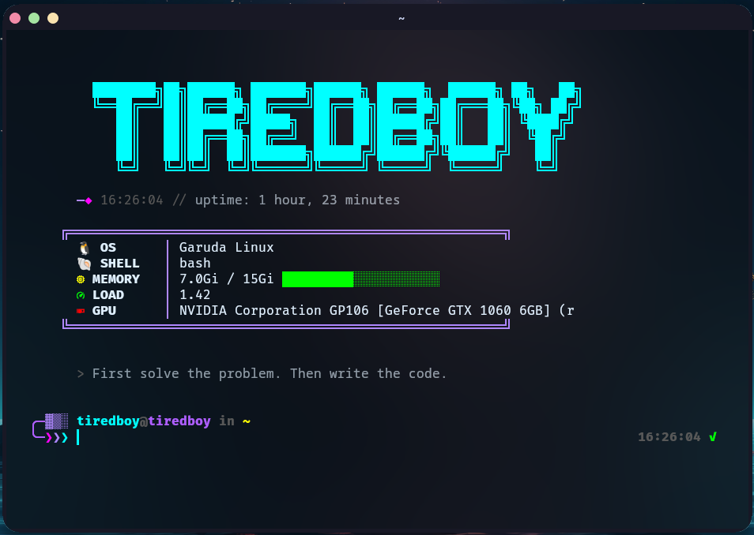

# ⚡ Cyberpunk ZSH + Kitty Terminal

A **modern, cyberpunk-inspired terminal setup** featuring **ZSH**, **Kitty**, and a curated set of fast, minimal, and powerful CLI tools.

Designed for:

* Developers who live in the terminal
* Power users who want speed + aesthetics
* Anyone who wants their GitHub profile to *look serious*

---

## ✨ Features

### 🧠 ZSH Shell

* Cyberpunk-themed multi-line prompt
* Git-aware prompt with clean status indicators
* Command execution timer (right prompt)
* Autosuggestions (history + completion)
* Real-time syntax highlighting
* Fuzzy tab completion
* Smart directory jumping with `zoxide`

### 🚀 Modern CLI Tools

* `eza` → modern `ls` with icons
* `bat` → syntax-highlighted `cat`
* `fd` → blazing-fast file search
* `fzf` → fuzzy finder everywhere

### 🖥️ Kitty Terminal

* Glassmorphism (blur + opacity)
* Neon cyberpunk color scheme
* Powerline-style tab bar
* Nerd Font icons
* Extensive custom keybindings

---

## 📸 Screenshots



```text
screenshots/
├── terminal-main.png
```

---

## 📦 Requirements

> 💡 **You don't need to install any of these by hand** — [`./install.sh`](#-installation) does it all for you. The list below is just for reference.

### Mandatory

* **zsh**
* **git**
* **kitty**
* **FiraCode Nerd Font**

### Recommended Tools

* `zsh-autosuggestions`
* `zsh-syntax-highlighting`
* `zoxide`
* `fzf`
* `fd`
* `eza`
* `bat`
* `neovim`

> Full per-distro package details are in [`docs/cyberpunk_zsh_kitty_setup_guide.md`](docs/cyberpunk_zsh_kitty_setup_guide.md)

---

## 🛠️ Installation

### ⚡ One command — installs *everything*

```bash
git clone https://github.com/tiredbooy/cyberpunk-terminal.git
cd cyberpunk-terminal
./install.sh
```

That's it. The installer:

* **Detects your package manager** — `pacman`, `apt`, `dnf`, `zypper` or `brew`
* **Installs every dependency** with the correct package name per distro
* **Installs the FiraCode Nerd Font** — from your repos on Arch, or straight from the official Nerd Fonts release everywhere else
* **Backs up** any existing `~/.zshrc` and `kitty.conf` to `~/.cyberpunk-terminal-backup/`
* **Deploys** the zsh, kitty and welcome-screen configs
* **Offers to set zsh** as your default login shell

### Installer flags

| Flag         | Effect                                          |
| ------------ | ----------------------------------------------- |
| `--yes` `-y` | Unattended — assume *yes* to every prompt       |
| `--minimal`  | Only the packages needed to boot without errors |
| `--no-chsh`  | Don't change your default login shell           |
| `--no-font`  | Skip installing the Nerd Font                   |
| `--help`     | Show usage                                      |

### Undo / restore

```bash
./uninstall.sh            # restore your previous configs from the backup
./uninstall.sh --purge    # also remove the deployed configs entirely
```

> Packages installed by the installer (zsh, kitty, fzf…) are **left in place** — they're useful on their own.

### Manual install (if you prefer)

```bash
cp zsh/zshrc-config.txt ~/.zshrc
mkdir -p ~/.config/kitty
cp kitty/kitty.conf ~/.config/kitty/kitty.conf
cp kitty/startup-welcome.sh ~/.config/kitty/startup-welcome.sh
chsh -s $(which zsh)   # optional
```

Restart your terminal.

> **Portable by design:** the zsh config detects plugins, `fzf`, `bat`/`batcat` and
> `fd`/`fdfind` at runtime from every common install location, so a missing tool
> degrades gracefully instead of erroring on startup.

---

## ⌨️ Kitty Keybindings

### Clipboard

| Shortcut         | Action |
| ---------------- | ------ |
| Ctrl + Shift + C | Copy   |
| Ctrl + Shift + V | Paste  |

### Windows & Splits

| Shortcut             | Action                          |
| -------------------- | ------------------------------- |
| Ctrl + Shift + Enter | New window                      |
| Ctrl + Shift + W     | Close window                    |
| Ctrl + Shift + O     | New OS window                   |
| Ctrl + Shift + \     | Split vertically (same dir)     |
| Ctrl + Shift + -     | Split horizontally (same dir)   |
| Ctrl + Shift + L     | Cycle layout                    |
| Ctrl + Shift + H/J/K | Focus split left / down / up    |
| Ctrl + Shift + ] / [ | Next / previous window          |

### Tabs

| Shortcut          | Action               |
| ----------------- | -------------------- |
| Ctrl + Shift + T  | New tab (same dir)   |
| Ctrl + Shift + Q  | Close tab            |
| Ctrl + Shift + →  | Next tab             |
| Ctrl + Shift + ←  | Previous tab         |
| Ctrl + Shift + 1…5| Jump to tab N        |
| Ctrl + Shift + . /, | Move tab fwd / back |
| Ctrl + Shift + R  | Rename tab           |

### Hints & Tools

| Shortcut             | Action                          |
| -------------------- | ------------------------------- |
| Ctrl + Shift + E     | Open a URL on screen            |
| Ctrl + Shift + P → F | Pick a file path                |
| Ctrl + Shift + P → L | Pick a whole line               |
| Ctrl + Shift + P → W | Pick a word                     |
| Ctrl + Shift + U     | Unicode character input         |
| Ctrl + Shift + F5    | Reload kitty config live        |
| Ctrl + Shift + F2    | Edit kitty config               |
| Ctrl + Shift + Del   | Clear & reset the terminal      |

### Font Size

| Shortcut         | Action   |
| ---------------- | -------- |
| Ctrl + Shift + = | Increase |
| Ctrl + Shift + - | Decrease |
| Ctrl + Shift + 0 | Reset    |

### Opacity Controls

| Shortcut             | Action           |
| -------------------- | ---------------- |
| Ctrl + Shift + A → M | Increase opacity |
| Ctrl + Shift + A → L | Decrease opacity |
| Ctrl + Shift + A → 1 | Full opacity     |
| Ctrl + Shift + A → D | Default opacity  |

---

## 🧩 Project Structure

```
cyberpunk-terminal/
├── install.sh                 # one-command cross-distro installer
├── uninstall.sh               # restore your previous configs
├── zsh/
│   └── zshrc-config.txt       # → deployed to ~/.zshrc
├── kitty/
│   ├── kitty.conf             # → ~/.config/kitty/kitty.conf
│   └── startup-welcome.sh     # → ~/.config/kitty/startup-welcome.sh
├── docs/
│   ├── cyberpunk_zsh_kitty_setup_guide.md
│   └── Cyberpunk Zsh + Kitty Setup Guide.pdf
├── screenshots/
└── readme.md
```

---

## ⚠️ Notes

* Nerd Fonts are **required** for icons and glyphs (the installer handles this)
* `cd` is replaced with `z` (via zoxide) **only when zoxide is installed**
* Kitty blur works best on Wayland or X11 with a compositor
* Completion uses a cached `compinit` — fast startup, with the security check run once a day
* The right prompt shows command runtime **only for commands slower than 200 ms**, keeping the prompt clean

---

## 🧠 Inspiration

Inspired by modern terminal workflows, cyberpunk aesthetics, and minimal fast tooling.

---

## ⭐ Contribute & Star

If you like this setup:

* ⭐ Star the repository
* 🐛 Open issues for improvements
* 🔧 Submit pull requests

---

**Built for speed. Styled for the future.** ⚡
