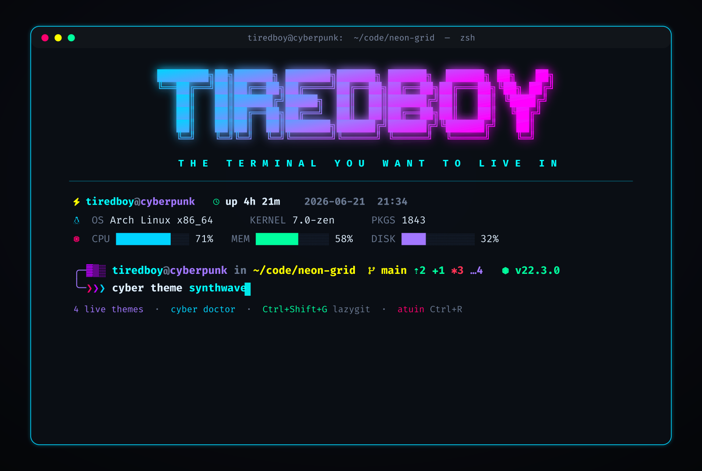
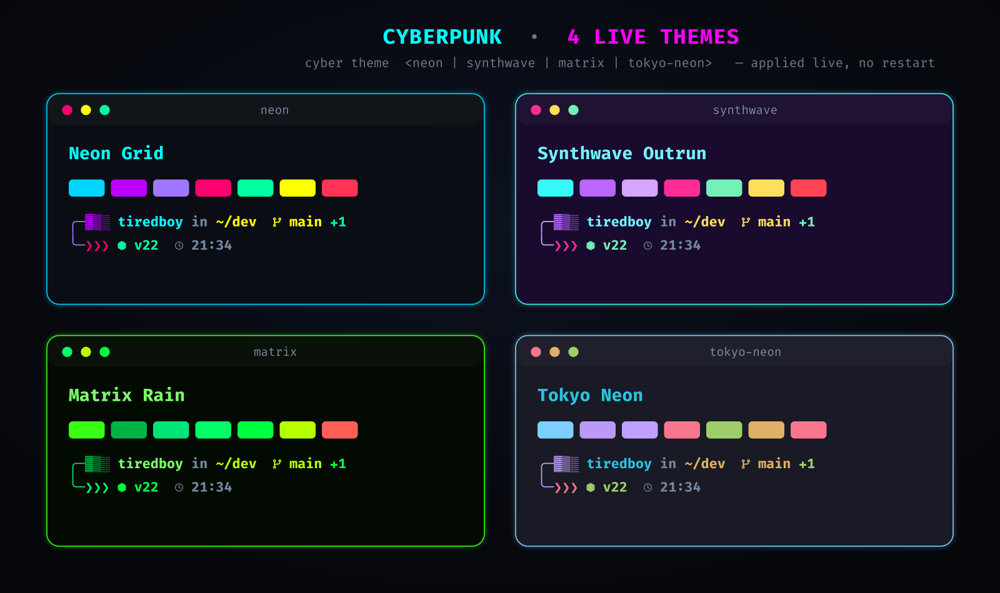

<div align="center">

# ⚡ Cyberpunk ZSH + Kitty Terminal

### The terminal you *want to live in.*

A neon, cyberpunk-themed **ZSH + Kitty** setup — live switchable themes, a custom tab bar,
an animated system dashboard, the modern TUI stack, and a one-command cross-distro installer.

[](LICENSE)
[](https://github.com/tiredbooy/cyberpunk-terminal/actions/workflows/ci.yml)


**[Install](#-installation)** · **[Themes](#-themes)** · **[Keybindings](#-kitty-keybindings)** · **[`cyber` panel](#-helper-commands)**



</div>

Built for:

* Developers who live in the terminal
* Power users who want speed **and** aesthetics
* Anyone who wants their setup to *look serious*

### Why this vs the alternatives

| Stack             | What it gives you                                  | What this adds                                                        |
| ----------------- | -------------------------------------------------- | -------------------------------------------------------------------- |
| **oh-my-zsh**     | A zsh plugin framework                             | No framework overhead; opinionated prompt, kitty config & TUI stack pre-wired |
| **prezto**        | A faster zsh framework                             | Same — plus the terminal *emulator* (kitty), themes, and a welcome dashboard  |
| **Omakub**        | A full Ubuntu desktop setup                        | Distro-agnostic, terminal-only, no desktop opinions; switchable themes         |
| **plain dotfiles**| Your own hand-rolled config                        | A cross-distro installer, theme engine, sessions, doctor, and `cyber` panel    |

It is not a framework — it's a set of plain files plus a `cyber` control panel,
deployed by one installer and fully runtime-detected, so missing tools never error.

---

## ✨ Features

### 🧠 ZSH Shell

* Cyberpunk-themed **multi-line prompt** — or switch to an optional **Starship** preset (`cyber prompt starship`)
* **Rich git status**: branch · ahead/behind (`⇡ ⇣`) · staged/dirty/untracked counts · stash
* **Runtime versions** auto-shown in project dirs (Node ⬢, Python, Rust, Go)
* **Transient prompt** — finished prompts collapse to a single glyph, keeping scrollback clean
* Command execution timer + exit status + clock (right prompt)
* Autosuggestions (history + completion) and real-time syntax highlighting
* **fzf-tab** — fuzzy, previewable tab completion popup
* **atuin** — full-screen, searchable shell history on `Ctrl+R`
* Smart directory jumping with `zoxide`
* Helper functions: `mkcd`, `extract`, `up`, `y`, `proj`, and the `cyber` control panel

### 🚀 Modern CLI Tools

* `eza` → modern `ls` with icons   ·   `bat` → syntax-highlighted `cat`
* `fd` → fast file search   ·   `fzf` → fuzzy finder everywhere
* `btop` → gorgeous system monitor   ·   `yazi` → TUI file manager with previews
* `lazygit` → full-screen git UI   ·   `atuin` → magical history
* `fastfetch` → fast system info   ·   `glow` → markdown in the terminal

### 🖥️ Kitty Terminal

* **Glassmorphism** (heavy blur + opacity)
* **Neon cursor trail** — a glowing comet streaks behind the cursor
* **Custom tab bar** — powerline tabs + a live status cluster (load · battery · clock)
* **Overlay tool launchers** — pop lazygit / btop / yazi over any window, return in place
* **More overlays** — hyperlinked `rg` + `fzf` grep, scrollback / last-output in nvim, an `ssh` kitten launcher, and input broadcast to every window
* **Command-finish notifications** for long jobs when the window is unfocused
* **Switchable themes** — `neon` · `synthwave` · `matrix` · `tokyo-neon`, applied live via `cyber theme`
* **Ready-made sessions** (`dev` · `ops` · `fullstack` · `writing`)
* Nerd Font icons + extensive custom keybindings (all under one `kitty_mod`)

### 🎬 Animated Welcome Dashboard

* Truecolor **gradient logo** + a quick, skippable boot/reveal animation
* Live panels: system (CPU / mem / disk bars), git summary, network, quote
* Optional weather + todos panels — fully **toggle-able** via environment variables

---

## 📸 Demo

The hero shot above and the [theme gallery](#-themes) are **rendered from the real palette,
ASCII logo and prompt** — regenerate them any time with `python3 screenshots/render.py`
(needs `rsvg-convert` + a Nerd Font).

An animated walkthrough is on the way — the [Charm VHS](https://github.com/charmbracelet/vhs)
script is checked in at [`demo/demo.tape`](demo/demo.tape) (render it with `vhs demo/demo.tape`).
See [`demo/README.md`](demo/README.md) for how to record one — VHS runs its own headless
terminal, so kitty's GPU effects (cursor trail, blur, custom tab bar) need a real screen
capture (wf-recorder / Peek / OBS) to show off.

---

## 📦 Requirements

> 💡 **You don't need to install any of these by hand** — [`./install.sh`](#-installation) does it all for you. The list below is just for reference.

### Mandatory

* **zsh**
* **git**
* **kitty**
* **FiraCode Nerd Font**

### Recommended Tools

* `zsh-autosuggestions`
* `zsh-syntax-highlighting`
* `zoxide`
* `fzf`
* `fd`
* `rg` (ripgrep — powers the hyperlinked-grep overlay)
* `eza`
* `bat`
* `neovim`

### Modern TUI Stack (auto-installed, optional)

* `btop` — system monitor
* `yazi` — file manager
* `lazygit` — git UI
* `atuin` — searchable history
* `fastfetch` — system info
* `glow` — markdown viewer
* `starship` — optional prompt
* `fzf-tab` — fuzzy completion (git-cloned to `~/.zsh/fzf-tab`)

> The installer fetches tools missing from your distro's repos from their
> official release/installer (landing in `~/.local/bin`). Everything
> degrades gracefully — a missing tool just disables its one feature.

> Full per-distro package details are in [`docs/cyberpunk_zsh_kitty_setup_guide.md`](docs/cyberpunk_zsh_kitty_setup_guide.md)

---

## 🛠️ Installation

### ⚡ One line — clone *and* install

```bash
curl -fsSL https://raw.githubusercontent.com/tiredbooy/cyberpunk-terminal/main/bootstrap.sh | bash
```

This `bootstrap.sh` clones (or updates) the repo into
`~/.local/share/cyberpunk-terminal` and hands off to its `install.sh`. Pass
installer flags through after a `--`:

```bash
curl -fsSL https://raw.githubusercontent.com/tiredbooy/cyberpunk-terminal/main/bootstrap.sh | bash -s -- --yes --no-chsh
```

### Or clone manually

```bash
git clone https://github.com/tiredbooy/cyberpunk-terminal.git
cd cyberpunk-terminal
./install.sh
```

Either way, the installer:

* **Detects your package manager** — `pacman`, `apt`, `dnf`, `zypper` or `brew` (incl. **macOS / Apple Silicon** via Homebrew, whose `shellenv` the zshrc wires up automatically)
* **Installs every dependency** — including **ripgrep** for the grep overlay — with the correct package name per distro
* **Installs the FiraCode Nerd Font** — from your repos on Arch, or straight from the official Nerd Fonts release everywhere else
* **Backs up** any existing `~/.zshrc` and `kitty.conf` to `~/.cyberpunk-terminal-backup/`
* **Deploys** the zsh, kitty, theme, session and welcome-screen configs
* **Creates `~/.config/cyberpunk/local.zsh`** (only if absent) — your personal override file, **never** overwritten or backed up by the installer
* **Offers to set zsh** as your default login shell

### Installer flags

| Flag         | Effect                                          |
| ------------ | ----------------------------------------------- |
| `--yes` `-y` | Unattended — assume *yes* to every prompt       |
| `--minimal`  | Only the packages needed to boot without errors |
| `--no-extra` | Skip the heavy TUI stack (btop, yazi, lazygit…) |
| `--no-chsh`  | Don't change your default login shell           |
| `--no-font`  | Skip installing the Nerd Font                   |
| `--help`     | Show usage                                      |

### Undo / restore

```bash
./uninstall.sh            # restore your previous configs from the backup
./uninstall.sh --purge    # also remove the deployed configs entirely
```

> Packages installed by the installer (zsh, kitty, fzf…) are **left in place** — they're useful on their own.

### Manual install (if you prefer)

```bash
# core configs
cp zsh/zshrc-config.txt ~/.zshrc
mkdir -p ~/.config/kitty ~/.config/kitty/sessions ~/.config/cyberpunk ~/.config/cyberpunk/themes
cp kitty/kitty.conf ~/.config/kitty/kitty.conf
cp kitty/startup-welcome.sh ~/.config/kitty/startup-welcome.sh

# kitty extras: custom tab bar + all sessions
cp kitty/tab_bar.py ~/.config/kitty/tab_bar.py
cp kitty/sessions/*.session ~/.config/kitty/sessions/

# shared files: helper functions, palette, optional starship prompt
cp zsh/functions.zsh      ~/.config/cyberpunk/functions.zsh
cp theme/palette.sh       ~/.config/cyberpunk/palette.sh
cp starship/starship.toml ~/.config/cyberpunk/starship.toml

# theme engine: presets + shipped neon defaults read by kitty & tab bar
cp theme/themes/*.sh      ~/.config/cyberpunk/themes/
cp theme/kitty-theme.conf ~/.config/kitty/kitty-theme.conf
cp theme/palette.json     ~/.config/cyberpunk/palette.json

# optional: tmux theme (survives ssh / headless where kitty effects can't)
cp tmux/cyberpunk.tmux.conf ~/.config/cyberpunk/cyberpunk.tmux.conf

chsh -s $(which zsh)   # optional
```

Restart your terminal.

> **Portable by design:** the zsh config detects plugins, `fzf`, `bat`/`batcat` and
> `fd`/`fdfind` at runtime from every common install location, so a missing tool
> degrades gracefully instead of erroring on startup.

---

## ⌨️ Kitty Keybindings

> **`kitty_mod` is `Ctrl + Shift`.** Every shortcut below is written `kitty_mod + …`
> — that's the single modifier kitty.conf declares once, so if you ever want a
> different base chord (say `Super`), change the one `kitty_mod` line and every
> binding moves with it.

### 🚀 TUI Tools & Overlays

Each opens as an overlay on the current window — quit the tool and you land
exactly back where you were.

| Shortcut            | Action                                                        |
| ------------------- | ------------------------------------------------------------ |
| kitty_mod + G       | `lazygit` (git UI)                                           |
| kitty_mod + N       | `btop` (system monitor)                                      |
| kitty_mod + Y       | `yazi` (file manager)                                        |
| kitty_mod + X       | Hyperlinked grep — `rg` + `fzf`, open the hit at its line in nvim |
| kitty_mod + M       | Open full scrollback in nvim (read-only)                    |
| kitty_mod + I       | Open the last command's output in nvim (read-only)          |
| kitty_mod + S       | `ssh` kitten launcher                                        |
| kitty_mod + Z       | Broadcast input to all windows                              |
| kitty_mod + F1      | Cyberpunk cheatsheet                                         |

> The grep overlay (`kitty_mod + X`) needs **ripgrep** and **fzf** installed;
> without them it shows a notice instead.

### Clipboard

| Shortcut       | Action |
| -------------- | ------ |
| kitty_mod + C  | Copy   |
| kitty_mod + V  | Paste  |

### Windows & Splits

| Shortcut            | Action                          |
| ------------------- | ------------------------------- |
| kitty_mod + Enter   | New window                      |
| kitty_mod + W       | Close window                    |
| kitty_mod + O       | New OS window                   |
| kitty_mod + \       | Split vertically (same dir)     |
| kitty_mod + -       | Split horizontally (same dir)   |
| kitty_mod + L       | Cycle layout                    |
| kitty_mod + H/J/K   | Focus split left / down / up    |
| kitty_mod + ] / [   | Next / previous window          |

### Tabs

| Shortcut             | Action               |
| -------------------- | -------------------- |
| kitty_mod + T        | New tab (same dir)   |
| kitty_mod + Q        | Close tab            |
| kitty_mod + →        | Next tab             |
| kitty_mod + ←        | Previous tab         |
| kitty_mod + 1…5      | Jump to tab N        |
| kitty_mod + . / ,    | Move tab fwd / back  |
| kitty_mod + R        | Rename tab           |

### Hints & Tools

| Shortcut            | Action                          |
| ------------------- | ------------------------------- |
| kitty_mod + E       | Open a URL on screen            |
| kitty_mod + P → F   | Pick a file path                |
| kitty_mod + P → L   | Pick a whole line               |
| kitty_mod + P → W   | Pick a word                     |
| kitty_mod + U       | Unicode character input         |
| kitty_mod + F5      | Reload kitty config live        |
| kitty_mod + F2      | Edit kitty config               |
| kitty_mod + Del     | Clear & reset the terminal      |

### Font Size

| Shortcut       | Action   |
| -------------- | -------- |
| kitty_mod + =  | Increase |
| kitty_mod + -  | Decrease |
| kitty_mod + 0  | Reset    |

### Opacity Controls

| Shortcut            | Action           |
| ------------------- | ---------------- |
| kitty_mod + A → M   | Increase opacity |
| kitty_mod + A → L   | Decrease opacity |
| kitty_mod + A → 1   | Full opacity     |
| kitty_mod + A → D   | Default opacity  |

---

## 🎨 Prompt: custom or Starship

The enhanced **custom prompt is the default**. A cyberpunk **Starship** preset
ships alongside it — switch any time:

```bash
cyber prompt starship   # use Starship   (needs starship installed)
cyber prompt custom     # back to the custom prompt
cyber prompt            # toggle between the two
cyber reload            # apply without opening a new shell
```

The choice is saved to `~/.config/cyberpunk/prompt`. You can also force it with
`export CYBERPUNK_PROMPT=starship` (or `custom`). Starship is only used when it's
actually installed — otherwise you always get the custom prompt.

Prompt-related toggles:

| Variable                | Effect                                            |
| ----------------------- | ------------------------------------------------- |
| `CYBERPUNK_TRANSIENT=0` | Disable the collapsing transient prompt           |
| `CYBERPUNK_RUNTIME=0`   | Hide the Node/Python/Rust/Go version segment      |
| `CYBERPUNK_SSH_BADGE=0` | Hide the `ssh <host>` prompt badge when over SSH  |

---

## 🎨 Themes

Four palettes ship in the box, each recoloring kitty, the custom tab bar, and the
Starship prompt at once:

<div align="center">

</div>

| Theme         | Label            |
| ------------- | ---------------- |
| `neon`        | Neon Grid (default) |
| `synthwave`   | Synthwave Outrun |
| `matrix`      | Matrix Rain      |
| `tokyo-neon`  | Tokyo Neon       |

```bash
cyber theme list        # show all themes, marking the active one
cyber theme synthwave   # switch (applies live in kitty + persists)
cyber theme next        # cycle to the next theme
cyber theme demo        # flash through them all, then restore
```

`cyber theme <name>` regenerates `~/.config/kitty/kitty-theme.conf` and
`~/.config/cyberpunk/palette.json`, retargets the Starship palette, and
**persists** the choice to `~/.config/cyberpunk/theme`. New shells read it
automatically; you can override at launch with `export CYBERPUNK_THEME=matrix`,
which takes precedence over the saved file.

> Custom presets are just shell files in `~/.config/cyberpunk/themes/<name>.sh`
> defining the `CYB_*` hex variables — copy one and tweak. See
> [`CONTRIBUTING.md`](CONTRIBUTING.md) for the add-a-theme guide.

### 📺 CRT background (opt-in)

A theme-tinted **scanline + vignette + faint phosphor-grid** layer that
recolours with the active palette. **Off by default** — it is a deliberate
retro effect, not the standard look.

```bash
cyber crt on        # enable at the last-used intensity (default subtle)
cyber crt subtle    # very faint, contrast-safe (the recommended preset)
cyber crt heavy     # denser scanlines + stronger vignette
cyber crt off       # disable + clear the background image
cyber crt status    # state, intensity, image, python interpreter, caveat
```

Toggle it live with **`kitty_mod + D → C`**; force it off with
**`kitty_mod + D → X`**. For a per-shell escape hatch, export
`CYB_CRT=off` (or `CYB_CRT=heavy` to force it on) — the env var wins over
the persisted `~/.config/cyberpunk/crt` state file.

The image is generated by a pure-stdlib Python writer (no PIL/numpy)
materialized at `~/.config/cyberpunk/crt-gen.py`, rendered to
`~/.config/cyberpunk/crt-bg.png` (at 1280×720 and upscaled by kitty's
`scaled` layout), and re-rendered from the new palette on every
`cyber theme` switch. A signature cache skips the render when the
theme + intensity are unchanged, so repeat switches stay fast. When on,
`background_image` directives are appended to the generated
`kitty-theme.conf` for boot persistence; when off they are stripped.
Needs `python3` (or falls back to `kitty +runpy`); with neither, the state
is saved but no image is generated.

> ⚠️ **Contrast caveat:** the CRT image fights `background_blur 80` +
> opacity `0.85` and can reduce text legibility. The default `subtle`
> preset is intentionally very faint; `cyber crt off`, `kitty_mod+D→X`,
> or `CYB_CRT=off` all turn it off instantly.

---

## 🧰 Helper commands

| Command         | What it does                                            |
| --------------- | ------------------------------------------------------- |
| `cyber help`    | Show the keybind & command cheatsheet                   |
| `cyber theme [name\|list\|next\|demo]` | Switch / list / cycle / preview themes (see [Themes](#-themes)) |
| `cyber crt [on\|off\|subtle\|heavy\|status]` | Toggle the opt-in CRT scanline/vignette background (see [CRT background](#-crt-background-opt-in)) |
| `cyber ctx [on\|off\|danger <re>\|refresh]` | Live operational-context HUD in the tab bar — git · k8s · cloud · docker · ssh; prod glows red |
| `cyber ai`/`fix`/`why`/`gca` | The opt-in AI copilot (see [The Deck](#-the-deck--ai-copilot)) |
| `cyber session [name]` | Launch a kitty session (`dev`/`ops`/`fullstack`/`writing`); no arg = fzf-pick |
| `cyber doctor`  | Health check — truecolor, Nerd Font, kitty version, and every optional tool |
| `cyber prompt`  | Switch custom ⇄ Starship prompt                         |
| `cyber opacity <v>` | Set the kitty window opacity live (e.g. `0.9`)      |
| `cyber reload`  | Re-source `~/.zshrc`                                    |
| `cyber update`  | `git pull --ff-only`, re-run the installer, then show the new commits (set `CYBERPUNK_REPO` if needed) |
| `y`             | Open `yazi`; cd to wherever you quit                    |
| `proj`          | Fuzzy-jump to a project (zoxide history + common roots) |
| `mkcd <dir>`    | Make a directory and enter it                           |
| `up [N]`        | Climb N directories                                     |
| `extract <a>`   | Unpack any archive (tar/zip/7z/zst/…)                   |
| `lg`            | `lazygit`   ·   `top`/`btm` → `btop`   ·   `fm` → `yazi` ·   `md` → `glow` |

---

## ⌁ Live context HUD — `cyber ctx`

A neon **operational-context cluster** in the kitty tab bar, just left of the
clock. From cheap file/env reads (no slow tool forks by default) it surfaces
your current **git branch**, **kubectl context** (`:namespace` when
`CYB_CTX_K8S_FORK=1`), **AWS/GCP profile**, **docker context**, **direnv**, and
**SSH host**. Any value matching `CYB_CTX_DANGER_RE` (default
`prod|production|prd`) renders **red and pulses** — so you always know when
you're pointed at production.

```bash
cyber ctx                 # print the current context (danger values in red)
cyber ctx on | off        # enable / disable the tab-bar HUD
cyber ctx danger '<re>'   # set & persist the danger regex
cyber ctx refresh         # force-write context.json now (after export AWS_PROFILE=…)
```

A cached `chpwd`/`precmd` hook writes `~/.config/cyberpunk/context.json`, which
`tab_bar.py` re-reads every redraw (so the HUD is genuinely live). Per-segment
toggles (`CYB_CTX_GIT` · `CYB_CTX_K8S` · `CYB_CTX_CLOUD` · `CYB_CTX_DOCKER` ·
`CYB_CTX_DIRENV` · `CYB_CTX_SSH`) and a refresh throttle (`CYB_CTX_TTL`) tune it;
the only forking probe (the k8s namespace) is opt-in via `CYB_CTX_K8S_FORK=1`,
so prompt latency is untouched. Flash it in an overlay with **`kitty_mod + D → S`**.

> The tab bar reads `palette.json` once at startup but `context.json` on **every
> redraw** — so the HUD updates live, though a *theme* change still needs a new
> kitty window for the tab cluster to recolour.

---

## 🤖 The Deck — AI copilot

An **opt-in** AI copilot in your shell. Every model call is routed through a
**single redaction firewall + network choke point** — secrets are scrubbed
*before* anything leaves your machine, and you see a one-line receipt proving it
ran. **Default OFF. Never auto-sends. Nothing happens until you run a command.**

| Command | What it does |
|---------|--------------|
| `cyber ai "<text>"` | Natural language → **one** shell command, staged on your prompt for review (never auto-run) |
| `cyber fix`  | Reads the last command + exit code + output, asks for a corrected command, stages it |
| `cyber why`  | Explains the last failed command in prose (rendered via `glow` if present) |
| `cyber gca` (or bare `gca`) | Drafts a Conventional-Commits message from `git diff --staged`; commits only after you confirm |

Commands are **staged** with zsh's `print -z` — they land on your next prompt so
you read them and press Enter yourself. Nothing executes automatically. `gca`
additionally requires an explicit `y` before it runs `git commit`.

### The redaction firewall

Before any request leaves your machine, `_cyber_ai_send` scrubs the text with a
python3 regex pass that masks: **AWS keys** (`AKIA…`/`ASIA…`), **GitHub**
(`ghp_`/`gho_`/`ghs_`/`ghu_`/`ghr_`), **GitLab** (`glpat-`), **OpenAI** (`sk-`),
**Slack** (`xox[baprs]-`) and **Google** (`AIza…`) tokens, **bearer /
authorization tokens**, **PEM private-key blocks**, **`.env`-style secrets**
(any `KEY=VALUE` whose name contains `PASSWORD`/`TOKEN`/`SECRET`/`KEY`/`API`/…),
**long hex / base64 blobs**, and (by default) your **`$HOME`** path. You get a
neon receipt like `⛨ scrubbed 3 secrets · ~412 tok · anthropic` *before* the
network call. **Redaction is a hard gate** — if python3 is missing, the request
is refused rather than sent un-scrubbed.

### Enabling it

```sh
export CYB_AI=1                      # master flag (default: off)
export ANTHROPIC_API_KEY=…           # provider key (read from env, never stored)
cyber ai setup                       # writes a template ~/.config/cyberpunk/ai.conf
```

No Anthropic key? Install [`ollama`](https://ollama.com) and The Deck falls back
to a local, no-key, no-network-egress provider automatically.

### Configuration (`~/.config/cyberpunk/ai.conf`)

A sourced `key=value` file holding **non-secret** settings only (generated by
`cyber ai setup`; needs no installer step):

| Key | Default | Purpose |
|-----|---------|---------|
| `AI_PROVIDER` | `anthropic` (→ `ollama` if no key & ollama present) | Backend |
| `AI_MODEL` | `claude-opus-4-8` / `llama3.1` | Model id (use `claude-haiku-4-5`/`claude-sonnet-4-6` for faster, cheaper replies) |
| `AI_ENDPOINT` | provider default | POST target |
| `AI_MAX_TOKENS` | `512` | Reply cap |
| `AI_TIMEOUT` | `20` | curl `--max-time` (seconds) |
| `AI_REDACT_HOME` | `1` | Mask `$HOME` as `~` before sending |
| `ANTHROPIC_API_KEY` | *(env only)* | Sent as `x-api-key`; **never** written to ai.conf |

### Keybinding (optional sugar)

A `kitty_mod+d>` chord launches each action in an overlay that runs the command
and shows its output (run-and-show only; the in-shell `print -z` path above is
the robust primary that stages for review):

| Chord | Action |
|-------|--------|
| `Ctrl+Shift+d` then `a` | `cyber ai` (ask) |
| `Ctrl+Shift+d` then `f` | `cyber fix` |
| `Ctrl+Shift+d` then `w` | `cyber why` |
| `Ctrl+Shift+d` then `g` | `cyber gca` (git-commit-assist) |

> `gca` overrides any pre-existing `gca` alias (e.g. the oh-my-zsh git plugin's
> `git commit --amend`) **only when the name is free** — it is defined guarded,
> so a layered alias is left intact.

---

## 🎬 Welcome dashboard toggles

The animated dashboard is shown once per window. Tune it by exporting these in
`~/.zshrc` **before** the welcome block (defaults shown):

| Variable                  | Default | Effect                              |
| ------------------------- | ------- | ----------------------------------- |
| `CYB_ANIMATE`             | `1`     | Boot + reveal animation             |
| `CYB_BOOT`                | `1`     | Boot text sequence (only when `CYB_ANIMATE=1`) |
| `CYB_REVEAL_DELAY`        | `0.012` | Per-line reveal delay (seconds)     |
| `CYB_GIT`                 | `1`     | Git panel (when cwd is a repo)      |
| `CYB_NET`                 | `1`     | Network panel (IP / Wi-Fi)          |
| `CYB_WEATHER`             | `0`     | Weather panel (cached ~3h)          |
| `CYB_WEATHER_LOCATION`    | auto    | e.g. `"Tehran"`                     |
| `CYB_TODOS`               | `0`     | Todos from `~/.config/cyberpunk/todo.txt` |
| `CYB_IMAGE`               | `0`     | Show an image logo (`icat`) instead of ASCII |

> Want the fastest possible startup? `export CYB_ANIMATE=0`.

---

## 🪟 Sessions & multiplexing

Four ready-made layouts ship in `~/.config/kitty/sessions/`:

| Session     | Layout                                                       |
| ----------- | ----------------------------------------------------------- |
| `dev`       | editor \| shell \| system monitor                           |
| `ops`       | monitor tab (btop + logs) \| ops tab (shell + lazydocker)   |
| `fullstack` | edit (nvim + shell) \| servers (backend + frontend) \| git  |
| `writing`   | a single focused nvim + shell pane                          |

```bash
cyber session                                          # fzf-pick a session
cyber session fullstack                                # launch one by name
kdev                                                   # shortcut for the dev layout
kitty --session ~/.config/kitty/sessions/dev.session --directory ~/code/proj
```

Combine with the built-in split keybinds (`kitty_mod + \` / `-`, `kitty_mod + L`
to cycle layouts, `kitty_mod + H/J/K` to move between splits).

### tmux

An optional, self-contained cyberpunk **tmux** theme ships at
`tmux/cyberpunk.tmux.conf` (deployed to `~/.config/cyberpunk/cyberpunk.tmux.conf`).
It mirrors the neon palette so the look survives over SSH / headless sessions
where kitty's GPU effects can't follow:

```bash
tmux -f ~/.config/cyberpunk/cyberpunk.tmux.conf
```

---

## 🧩 Project Structure

```
cyberpunk-terminal/
├── bootstrap.sh               # curl|bash one-liner: clone/update + run install.sh
├── install.sh                 # one-command cross-distro installer (+ fallbacks)
├── uninstall.sh               # restore your previous configs
├── zsh/
│   ├── zshrc-config.txt       # → ~/.zshrc
│   └── functions.zsh          # → ~/.config/cyberpunk/functions.zsh  (the cyber panel)
├── kitty/
│   ├── kitty.conf             # → ~/.config/kitty/kitty.conf  (uses kitty_mod + include)
│   ├── tab_bar.py             # → ~/.config/kitty/tab_bar.py  (theme-aware tab bar)
│   ├── startup-welcome.sh     # → ~/.config/kitty/startup-welcome.sh
│   └── sessions/
│       ├── dev.session        # → ~/.config/kitty/sessions/  (dev | ops | fullstack | writing)
│       ├── ops.session
│       ├── fullstack.session
│       └── writing.session
├── starship/
│   └── starship.toml          # → ~/.config/cyberpunk/starship.toml  (optional prompt, themed)
├── theme/
│   ├── palette.sh             # → ~/.config/cyberpunk/palette.sh  (theme engine + cyb_apply_theme)
│   ├── kitty-theme.conf       # → ~/.config/kitty/kitty-theme.conf  (shipped neon default)
│   ├── palette.json           # → ~/.config/cyberpunk/palette.json  (read by tab_bar.py)
│   └── themes/                # → ~/.config/cyberpunk/themes/
│       ├── neon.sh            #     neon · synthwave · matrix · tokyo-neon presets
│       ├── synthwave.sh
│       ├── matrix.sh
│       └── tokyo-neon.sh
├── tmux/
│   └── cyberpunk.tmux.conf    # → ~/.config/cyberpunk/cyberpunk.tmux.conf  (optional)
├── demo/
│   ├── demo.tape              # Charm VHS walkthrough script
│   └── README.md
├── docs/
│   ├── cyberpunk_zsh_kitty_setup_guide.md
│   └── Cyberpunk Zsh + Kitty Setup Guide.pdf
├── screenshots/
│   ├── hero.png               # rendered hero banner (top of this readme)
│   ├── themes.png             # four-theme gallery
│   └── render.py              # regenerates the art from the real palettes
├── .github/workflows/ci.yml   # lint + artifact validation + install smoke test
├── CHANGELOG.md
├── CONTRIBUTING.md
├── LICENSE                    # MIT
└── readme.md
```

> `~/.config/cyberpunk/local.zsh` (your personal override) and
> `~/.config/cyberpunk/theme` (the saved theme name) are treated as **user data** —
> created if absent and never overwritten by the installer or uninstaller.

---

## ⚠️ Notes

* Nerd Fonts are **required** for icons and glyphs (the installer handles this)
* `cd` is replaced with `z` (via zoxide) **only when zoxide is installed**
* Kitty blur works best on Wayland or X11 with a compositor
* The **cursor trail** needs **kitty ≥ 0.36**; older kitty prints a harmless warning and ignores it
* The **custom tab bar** needs `~/.config/kitty/tab_bar.py` (deployed by the installer); it reads `~/.config/cyberpunk/palette.json` for its colors and falls back to neon if absent. To revert, set `tab_bar_style powerline` in `kitty.conf`
* `kitty.conf` `include`s `kitty-theme.conf` (generated by `cyber theme`); the shipped neon default is deployed so first launch works before you ever switch themes
* The tab bar reads the palette **at startup** — switch themes with `cyber theme`, then restart kitty for the tab cluster to pick up the new colors (the rest of kitty recolors live)
* Tools missing from your distro's repos are installed to `~/.local/bin`; the zshrc adds that (plus `~/.cargo/bin`, `~/.atuin/bin`) to your `PATH`
* Completion uses a cached `compinit` — fast startup, with the security check run once a day
* The right prompt shows command runtime **only for commands slower than 200 ms**, keeping the prompt clean

---

## 🆕 What's New

The setup was modernised into a terminal you actually want to live in:

* **Switchable themes** (`neon` / `synthwave` / `matrix` / `tokyo-neon`) via `cyber theme`, recoloring kitty, the tab bar, and Starship in one go
* **`cyber doctor`** health check and a smarter **`cyber update`** (pull + redeploy + show new commits)
* **More overlays**: hyperlinked grep, scrollback / last-output in nvim, an `ssh` kitten, and input broadcast
* **Neon cursor trail**, a **theme-aware tab bar** with a live status cluster, and **command-finish notifications** in kitty
* **Overlay launchers** for lazygit / btop / yazi (`kitty_mod + G/N/Y`)
* **More sessions** (`dev` / `ops` / `fullstack` / `writing`) plus an optional **tmux** theme
* **Animated, gradient welcome dashboard** with system / git / network panels (all toggle-able)
* **Richer prompt** (git counts, ahead/behind, runtime versions, transient prompt, SSH badge) **+ an optional Starship preset**
* A **`curl | bash` bootstrap**, a `local.zsh` override that's never clobbered, and **macOS / Apple Silicon** support

See [`CHANGELOG.md`](CHANGELOG.md) for the full list.

---

## 🧠 Inspiration

Inspired by modern terminal workflows, cyberpunk aesthetics, and minimal fast tooling.

---

## ⭐ Contribute & Star

If you like this setup:

* ⭐ Star the repository
* 🐛 Open issues for improvements
* 🔧 Submit pull requests

See [`CONTRIBUTING.md`](CONTRIBUTING.md) for ground rules, the deploy-path table,
local dev commands that mirror CI, and a step-by-step add-a-theme guide. Released
under the [MIT License](LICENSE).

---

**Built for speed. Styled for the future.** ⚡
